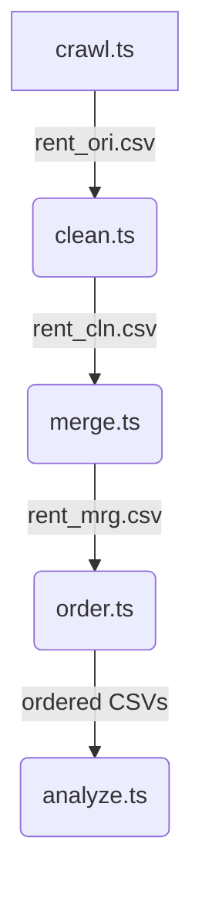

# Data Cleaning Rules – Taipei Rent Dataset

> Last updated: 2025‑05‑26 &#x20;

## Pipeline Overview &#x20;

## Stage 1 – Web Crawl & Raw Filtering (`crawl.ts` → **rent\_ori.csv**) &#x20;

* **Source files:** quarterly ZIPs `lvr_landcsv.zip` (101S1 – 114S1) downloaded from the Ministry of the Interior. &#x20;
* **Keep only Taipei rows** (`a_*_c.csv`). &#x20;
* **Row‑level filters**

  | Condition                                                                 | Rule                   | Removal rationale          |
  | ------------------------------------------------------------------------- | ---------------------- | -------------------------- |
  | `交易標的` ∈ {土地, 車位, 建物}                                           | ✗ drop                 | keep only 房地租賃 records |
  | `都市土地使用分區` + `非都市土地使用分區` contains “住” **OR** both empty | ✓ keep; otherwise drop |                            |
  | Must have either `租賃年月日` **or** `租賃期間`                           | otherwise drop         |                            |
* **Deduplication** on `編號‑交易年月日‑土地位置建物門牌` (first winner kept). &#x20;

## Stage 2 – Primary Cleaning (`clean.ts` + `helpers.ts` → **rent\_cln.csv**) &#x20;

### 2.1 Row‑exclusion rules (`getRemovalReason`) &#x20;

| Code                              | Meaning                                | Logic                                |
| --------------------------------- | -------------------------------------- | ------------------------------------ |
| 用途不符                          | 非住宅用途                             | `主要用途` **must** match [\`/住家用 \| 住宅…/\`] |
| 交易標的不符                      | `交易標的` 含 “房地”                   | drop                                 |
| 無須車位出租相關資訊              | `車位類別` ≠ ""                        | drop                                 |
| 租賃筆棟數不符                    | 土地=0 **and** 建物=0                  | drop                                 |
| 租賃層次不明                      | `租賃層次` = 見其他登記事項            | drop                                 |
| 主要建材不明                      | `主要建材` = 見其他登記事項/見使用執照 | drop                                 |
| 單價為零                          | `單價元平方公尺` empty                 | drop                                 |
| 建築完成年月缺失 / 租賃年月日缺失 | ROC dates un‑parsable                  | drop                                 |
| 房／廳／衛過大                    | any layout count > 100                 | drop (防異常值)                      |
| 總額缺失                          | `總額元` unparsable                    | drop                                 |

### 2.2 Column drops &#x20;

The following columns are **deleted outright**: `交易標的`, `土地面積平方公尺`, …, `備註`, `source_file` (see `DROP_COLS`). &#x20;

### 2.3 Field transformations (`transformRow`) &#x20;

* **Date**: ROC `YYYMMDD` → ISO `YYYY‑MM‑DD` for `租賃年月日` & `建築完成年月`; calculate `屋齡` and categorical `屋齡分類`  .
* **交易筆棟數**: parse “土地 x 建物 y 車位 z” into numeric `交易筆棟數‑土地/建物`.
* **租賃期間**: convert “起\~迄” to days (`租賃天數`).
* **分類**:

  * `主要用途分類` via `purposeClassify` &#x20;
  * `建材分類` via `buildingMaterialClassify` &#x20;
  * `租賃層次(四類)` via `floorChange` &#x20;
* **Boolean flags**: textual “有/無” → 1/0/NA for 管理組織、附傢俱、電梯、管理員、隔間.
* **附屬設備展開**: split by `、 , ，` and add binary columns `附屬設備‑<item>` for the union set of all observed equipment. &#x20;
* Empty but essential categorical / textual fields filled with `"NA"`  .

## Stage 3 – MRT Enrichment (`merge.ts` → **rent\_mrg.csv**) &#x20;

1. **Left‑join** `rent_cln.csv` (left) with `mrt.csv` (right) on `編號`  .
2. **Copy** MRT columns: `x`, `y`, `最近捷運站`, `捷運站距離.公尺.`, individual line flags, `通車日期`, `附近建物單位成交均價`  .
3. **Derived**

   * `捷運線` – comma‑separated active lines &#x20;
   * `轉乘站` – 1 if ≥ 2 active lines else 0 &#x20;
4. **Rename columns**

   * `x` → `座標 x` &#x20;
   * `y` → `座標 y` &#x20;
   * `捷運站距離.公尺.` → `捷運站距離(公尺)` &#x20;
5. **Row filter**: drop when `附近建物單位成交均價` is empty. &#x20;
6. **Column drop**: remove `編號` after merge. &#x20;

## Stage 4 – Canonical Column Ordering (`order.ts`) &#x20;

* Defines a **preferred header order** (`headerOrder` array). Only existing columns are reordered; none are created or removed. &#x20;
* For each CSV in `/dataset`, overwrite in‑place with the reordered columns. &#x20;

---

## Notes &#x20;

* `MAX_LAYOUT` is set to **100** to catch obvious data entry errors. &#x20;
* All numeric conversions safely coerce strings with commas (e.g., "1,234") to numbers; failures yield `null` and may trigger row removal. &#x20;
* The cleaning scripts log a summary of removal counts and remaining rows for transparency. &#x20;

---

End of rules.
